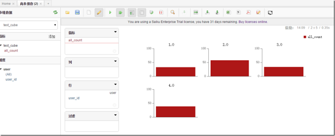

---  
layout: post  
#标题配置  
title:  SAIKU OLAP分析平台简介  
#时间配置  
date:   2017-06-26 13:58:00 +0800  
#大类配置，比如大数据，数据挖掘，数据分析等  
categories: 平台组  
#小类配置，比如hive，spark，HDFS等  
tag: OLAP  
---  
  
* content  
{:toc}  
  
  
# 简介  
SAIKU是世界上最伟大的开源OLAP 浏览器。它可以分析和展现数据，无论它是否是持久化存储数据。它以多样方式展现你的应用数据，无论是网站数据还是数据仓库数据。SAIKU通过提供一个Schema设计器、交互式的报表引擎、展示板和nosql连接技术，saiku分析平台为你的分析需求提供了一个端到端的完整解决方案。  
 官网主页：  
http://www.meteorite.bi  
  
# 起源  
Saiku成立于2008年，由Tom Barber和Paul Stoellberger研发。  
  
最初叫做Pentaho分析工具，起初是基于OLAP4J库用GWT（google web toolkit）包装的一个前端分析工具。  
  
经过多年的演化、重写之后，于2010年，改名为Saiku。  
  
如今已成为一个强大的独立工具，基于 Mondrian OLAP 引擎，用于查询构建数据集市。  
如：即席查询报表、图表展示、导出报表成excel或csv格式等。  
  
1.saiku 前端界面不太适合开放用户使用，比较适合企业级应用  
  
2.saiku 使用jersey rest 框架 cube处理可调用 rest 接口，最好自己开发前端，然后调用saiku的接口  
  
3.saiku 本地化使用的是js来处理的  
   
# 特点  
1、 轻量级的OLAP分析引擎，可以方便的扩展、嵌入和配置。  
2、通过REST API连接OLAP系统，利用其友好的界面为用户提供直观的分析数据的方式。  
3/ 界面使用HTML、CSS和Javascript实现，从而使得它非常容易自定义。  
4/ 通过使用REST的标准，服务器可以很容易地集成到不同的用户界面和第三方应用程序上，  
　　唯一的要求是第三方应用程序可以发送和接受HTTP通信和接收JSON格式的数据。  
　　客户端程序不需要了解MDX和相关的查询语言。  
  
# 安装构建  
  
## 安装jdk  
1、将jdk8的安装文件下载至/usr目录下  
```
cd /usr  
wget --no-check-certificate --no-cookies  http://10.10.10.67/eclipse/jdk8/jdk-8u131-linux-x64.tar.gz
```  
  
2、解压缩jdk8安装文件；  
`tar -zxvf  jdk-8u131-linux-x64.tar.gz`  
  
3、修改/etc/profile  
使用以下命令：  
`vim  /etc/profile`  
在文件中增加以下信息：  
```shell
export JAVA_HOME=/usr/jdk1.8.0_131  

export JRE_HOME=${JAVA_HOME}/jre

export CLASSPATH=.:${JAVA_HOME}/lib:${JRE_HOME}/lib
   
export PATH=${JAVA_HOME}/bin:$PATH
```  
  
4、使上述配置立即生效  
`source /etc/profile`  
  
5、查看jdk是否安装成功；  
`java -version`  
## 安装maven  
1、将maven的安装文件下载至/usr目录下  
`cd /usr`   
`wget --no-check-certificate --no-cookies  http://10.10.10.67/eclipse/jdk8/apache-maven-3.5.0-bin.tar.gz`  
  
2、解压缩maven安装文件；  
`tar -zxvf  apache-maven-3.5.0-bin.tar.gz`  
  
3、修改/etc/profile,  
`vim /etc/profile`  
增加以下信息  
  
`export M2_HOME=/usr/apache-maven-3.5.0   
export PATH=${M2_HOME}/bin:$PATH`  
  
4、使上述配置立即生效  
`source /etc/profile`  
  
5、查看maven是否安装成功；  
`mvn --version`  
  
## maven构建  
`mvn clean install -DskipTests  
mvn clean clover2:setup test clover2:aggregate clover2:clover`  
以上maven构建方式，由于无法连接到国外的源，所以未能构建成功。  
添加阿里云镜象：  
修改maven根目录下的conf文件夹中的setting.xml文件，内容如下：  
``` 
  <mirrors>  
    <mirror>   
      <id>alimaven</id>   
      <name>aliyun maven</name>   
      <url>http://maven.aliyun.com/nexus/content/groups/public/</url>  
      <mirrorOf>central</mirrorOf>  
    </mirror>  
   </mirrors>
```  
  
## 下载社区版  
通过以下url下载安装jar包：  
http://www.meteorite.bi/products/saiku/download  
  
解压缩saiku-latest.zip  
  
## 启动  
`cd /apps/saiku-server/  
./start-saiku.sh`  
  
## 使用说明：  
	开发机登录地址如下：
	http://192.168.10.114:8080/  
	用户名：admin
	密码：admin  
  
### 1、新建查询，一共有18步操作步骤，现示例关键的几步：  
  
####  选择Admin Console  
  

  
####  上传schma  
  
  
  
以下为Schema内容  
```  
<Schema name="test_schema">  
	<cube name="test_cube">  
		<Table name="t_data"/>  
			<Dimension name="user" foreignKey="user_id">  
				<Hierarchy hasAll="true" allMemberName="user_id" primaryKey="user_id"><Table name="t_user"/>  
					<Level name="user_id" column="user_id" uniqueMembers="true" type="Integer"/>  
				</Hierarchy>  
			</Dimension>  
			<Measure column="count" aggregator="sum" datatype="Numeric" name="all_count" caption="all_count"/>  
	</cube>  
</Schema>
```  
提示上传成功  
  
  
  
#### 在mysql中建表，然后添加数据源  
```
CREATE TABLE t_data  
(  
  user_id integer,  
  count numeric(4,2)  
);  
CREATE TABLE t_user  
(  
  user_id serial NOT NULL,  
  user_name character varying(50),  
  pwd character varying(50)  
);
```   

 
--t_data的数据  

|  user_id            |  count            |      
|  :-------------     | :-------------:   |     
|  1     	          |  33               |   
|  2     	          |  32               |   
|  3     	          |  34               |   
|  4     	          |  38               |   
  
--t_user的数据  

|  user_id         |  user_name          |  pwd              |    
|  -----------     | :-------------      | :-----------      |     
|  1     	       |  user1              | 1                 |   
|  2     	       |  user2              | 2                 |   
|  3     	       |  user3              | 3                 |   
|  4     	       |  user4              | 4                 |   
  
  
数据源配置，根据自己的连接情况进行相应的配置：  
  
    
  
重新启动服务，然后选择多维数据查看，通过简单的配置，就可以得到此立方体下的各种维度的query和图表。  
  
   
  
## Saiku去掉登录模块  

1、修改applicationContext-saiku-webapp.xml  
```
	<security:intercept-url pattern="/rest/**" access="IS_AUTHENTICATED_ANONYMOUSLY" />
	<security:intercept-url pattern="/json/**" access="IS_AUTHENTICATED_ANONYMOUSLY" />  
```
 2、在saiku-beans.xml中添加allowAnonymous属性  
```
	<bean id="sessionService" class="org.saiku.web.service.SessionService"> 
		<property name="authenticationManager" ref="authenticationManager" />
		<property name="allowAnonymous" value="true" />
	</bean
```  
